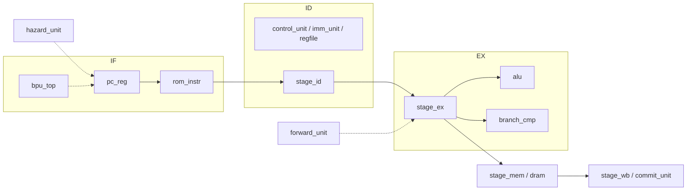

# RISC-V CPU 核（流水线）— 协作说明

本仓库为竞赛/课程用 **五级流水线 RISC-V 处理器** 的 RTL 骨架：目录与模块划分已就绪，各 `*.sv` 文件内 **文件头注释** 描述功能与接口审查要点；**具体实现由队友在对应模块内完成**。

---

## 1. 目录结构（概览）

| 路径 | 含义 |
|------|------|
| `rtl/include/cpu_defines.sv` | 位宽、ALU 编码、访存 mask、前递选择宏等全局定义 |
| `rtl/core/core_top.sv` | 顶层：仅例化与连线（规范：子模块前缀 `u_`，流水线时钟/复位命名 `F/D/E/M/W`） |
| `rtl/core/if/` | 取指：`stage_if`（IF 级封装）、`pc_reg`、`rom_instr` |
| `rtl/core/id/` | 译码：`stage_id`、`control_unit`、`regfile`、`imm_unit` |
| `rtl/core/ex/` | 执行：`stage_ex`、`alu`、`branch_cmp` |
| `rtl/core/mem/` | 访存：`stage_mem`、`dram` |
| `rtl/core/wb/` | 写回：`stage_wb`、`commit_unit` |
| `rtl/core/control/` | 控制：`hazard_unit`、`forward_unit`、`bpu_top` |
| `rtl/core/pipeline_regs/` | 流水线寄存器：`reg_if_id`、`reg_id_ex`、`reg_ex_mem`、`reg_mem_wb` |

---

## 2. 流水线与数据通路（概念）

### 2.1 五级划分

1. **IF**：根据 `pc_next` 更新 PC，从指令 ROM 取指令；可与 **BPU** 给出预测 PC/目标。
2. **ID**：指令译码、立即数扩展、读寄存器堆；产生控制信号与寄存器地址。
3. **EX**：**前递** 后的操作数选择、ALU/分支相关计算；分支结果与 **BPU 更新**、**flush** 信息在此汇聚。
4. **MEM**：按 `mem_addr`/`mask` 访问 **DRAM**（load/store）。
5. **WB**：在 ALU 结果与存储器读数据之间选择写回数据（`wb_src`）；`commit_unit` 与 `stage_wb` 接口一致，便于按团队分工二选一或分层使用。

### 2.2 控制与冒险

- **forward_unit**：根据 `rd` 在 EX/M、M/W 的有效性，产生 `b1/b2/t1/a1/a2` 多路选择信号，供 EX 级选真实操作数。
- **hazard_unit**：处理 **load-use** 停顿（`mem_read` & 寄存器相关），以及 **分支预测错误**（`branch_cmp` 的 `error` / 正确 PC）导致的 flush/stall；输出各级 `stall_*`、`flush_*` 与下一拍 `pc_next`。

### 2.3 数据通路示意（Mermaid）

（连线细节以 `core_top` 例化为准；上图为协作时脑图。）

---

## 3. 关键信号约定（跨模块）

| 信号类 | 说明 |
|--------|------|
| `pc_predict` | 与取指/BPU 一致的“当前指令所用的预测目标或下址”，贯穿 IF/ID 流水寄存，供 EX 比较与 hazard 使用 |
| `inst_spec` | 4 位指令类别/特例编码，供前递、分支、ALU 特例等统一判断（具体编码在实现时文档化） |
| `alu_ctrl` | 与 `cpu_defines.sv` 中 `ALU_*` 一致 |
| `mem_mask` | 与 `MASK_BYTE/HALF/WORD` 一致，用于对齐与字节使能 |
| 前递选择 `b1/b2/t1/a1/a2` | 与宏 `B1_*`、`A2_*` 等一致：选寄存器堆、EX/M 结果、M/W 结果、PC/立即数等 |

---

## 4. 协作时注意点

1. **宏与工具链**：`cpu_defines.sv` 中若使用 `ROM_ADDR_BUS` 等宏，请确认与 `ROM_ADDR_WID` 一致（详见该文件头注释）。
2. **命名一致性**：分支/冒险侧存在 `updata`/`rigit` 等拼写，若修改端口名需全设计联动；保持与注释一致即可。
3. **ROM/DRAM 地址**：`rom_instr`/`dram` 使用 `ROM_ADDR_BUS`/`RAM_ADDR_BUS`；若按 **字索引** 寻址，顶层需对 PC 做右移或掩码，团队内需统一。
4. **stage_wb 与 commit_unit**：当前端口相同，实现阶段请约定是 **仅 WB 多路选择** 还是 **提交级再封装一层**，避免重复逻辑。

---

## 5. 仿真与综合（占位）

- 顶层端口目前仅为 `clk`、`rst_n`；外设、AXI、调试接口等按赛题再扩展。
- 建议统一仿真工具（如 Verilator / ModelSim）与 `filelist.f`；具体脚本可在后续提交中补充。

---

## 6. 与 RTL 注释的关系

各模块 **源文件顶部注释块** 包含：

- **功能说明**：该模块在流水线中的职责；
- **接口审查**：端口位宽、语义、可优化点、与全局宏的一致性（**不替代**具体实现）。

实现代码时请以 **模块端口列表** 与 **`cpu_defines.sv`** 为准；若审查意见与实现冲突，团队评审后更新注释或接口。
