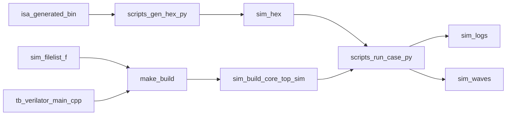

# Verilator 仿真说明

## 目标

本文件说明 `riscv_cpu` 当前的自动化仿真流程，重点覆盖：

- 使用 `Verilator + GTKWave` 的方式
- `isa` 产物如何转成 `IROM` 初始化文件
- 每个仿真相关文件的作用
- 在 WSL 下的典型使用方法
- 运行后输出文件所在位置

---

## 整体流程

当前仿真链路如下：

1. `tests/isa/<suite>/*` 作为测试程序输入（默认 `suite=rv32ui`）
2. `scripts/gen_hex.py` 优先读取 `<case>.bin`，找不到时自动回退 `<case>.dat`，并转成 `sim/hex/*.hex`
3. `make build` 用 `Verilator` 编译 `rtl` 和 `tb/verilator_main.cpp`
4. `scripts/run_case.py` 或 `scripts/run_rv32ui.py` 启动仿真可执行文件
5. 仿真时通过 `+IROM=...` 把 hex 路径传给 `irom`，并通过 `+DRAM=...` 传给 `dram`
6. 可选输出 `.fst` 波形，使用 `GTKWave` 打开

---

## 目录与文件作用

### 顶层入口

- `makefile`
  - 仿真主入口
  - 提供 `build`、`smoke`、`run`、`rv32ui`、`wave`、`gen-hex`、`clean`

- `sim/filelist.f`
  - Verilator 编译使用的唯一 RTL 文件列表
  - 避免维护多套 source list

### RTL 侧仿真钩子

- `rtl/core_top.sv`
  - 仿真系统顶层
  - 例化 `core`、`irom`、`dram`
  - 导出调试口：当前 PC、DRAM 写使能、写地址、写数据、写 mask

- `rtl/uncore/irom.sv`
  - 指令 ROM
  - 通过 `$readmemh` 加载 hex
  - 支持运行时 plusarg：`+IROM=<path>`

- `rtl/uncore/dram.sv`
  - 数据 RAM
  - 支持运行时 plusarg：`+DRAM=<path>`
  - 当前主要给程序运行和 smoke 检查使用

### Testbench / Harness

- `tb/verilator_main.cpp`
  - Verilator 的 C++ harness
  - 负责时钟、复位、最大周期数、trace 输出、PASS/FAIL PC 判定

- `tb/tb_config.h`
  - harness 的默认配置
  - 例如默认最大周期数、复位周期数

### 脚本

- `scripts/gen_hex.py`
  - 把 `tests/isa/<suite>/<case>.bin` 转成 `sim/hex/<case>.hex`
  - 若 `.bin` 不存在，自动读取同名 `.dat`

- `scripts/run_case.py`
  - 运行单个用例
  - 自动生成 hex
  - 支持 `--suite` 选择测试集目录（例如 `rv32uimine`）
  - 默认将同一份 case hex 同时传给 IROM/DRAM（可用 `--dram-hex` 覆盖）
  - 自动从 `.txt`（或回退 `.dump`）解析 `pass` / `loop_pass` / `fail` / `loop_fail`
  - 支持 `--allow-timeout-pass`，用于无 pass/fail 标签的自定义死循环测试
  - 生成对应日志和波形

- `scripts/run_rv32ui.py`
  - 按 manifest 批量跑 `rv32ui`
  - 汇总通过/失败数量

### 用例清单与输入

- `tests/manifest/rv32ui.txt`
  - 批量回归时实际要运行的 case 清单

- `sim/smoke.hex`
  - 最小 smoke test 的 ROM 镜像
  - 用于快速验证构建链和基本执行链路

---

## 依赖关系



---

## WSL 使用方法

以下假设你已经在 WSL 里安装了：

- `verilator`
- `gtkwave`
- `python3`
- `make`
- `g++`

并且当前目录位于：

```bash
cd /mnt/d/Resourses/03_competitions/26_03_jcs/riscv_cpu
```

### 1. 先确认本地测试输入

运行前请确认测试输入文件已经放在：

```bash
tests/isa/<suite>/
```

当前自动化流程默认直接从 `tests/isa/rv32ui/` 读取，可通过 `SUITE`/`--suite` 切换：

- `*.bin`（优先）
- `*.dat`（当 `.bin` 不存在时自动回退）
- `*.txt`
- `*.dump`

说明：

- `tests/isa` 才是本项目仿真真正使用的输入目录
- 外部同级 `isa` 文件夹现在只作为格式和工具逻辑参考，不参与实际运行

### 2. 构建 Verilator 可执行文件

```bash
make build
```

生成物会放在：

- `sim/build/`

### 3. 跑最小 smoke test

不出波形：

```bash
make smoke
```

出波形：

```bash
make smoke TRACE=1
```

### 4. 跑单个 ISA 用例

例如：

```bash
make run CASE=rv32ui-p-add
```

运行自定义 `rv32uimine` 用例：

```bash
make run SUITE=rv32uimine CASE=rv32uimine-p-pipeline_test_h
```

如果你的自定义用例没有 `pass/fail` 标签，希望“跑到最大周期就算通过”：

```bash
make run SUITE=rv32uimine CASE=rv32uimine-p-pipeline_test_h ALLOW_TIMEOUT=1
```

一次跑完整个 `rv32uimine` 测试集（与 `rv32ui` 同风格）：

```bash
make rv32uimine
```

说明：

- `rv32uimine` 默认优先使用每个 case 的 `pass/loop_pass`、`fail/loop_fail` 标签判定
- 已适配 `*_h.dat` 与去 `_h` 的 `*.dump`/`*.txt` 符号文件命名差异
- `rv32uimine` 默认使用更大的最大周期（`UIMINE_MAX_CYCLES=200000`）
- 如需覆盖默认值：`make rv32uimine UIMINE_MAX_CYCLES=500000`

如果想要波形：

```bash
make run CASE=rv32ui-p-add TRACE=1
```

### 5. 批量跑 `rv32ui`

```bash
make rv32ui
```

如果需要每个 case 都输出波形：

```bash
make rv32ui TRACE=1
```

### 6. 批量跑任意 suite

例如批量跑 `rv32uimine`：

```bash
make suite SUITE=rv32uimine
```

说明：

- 脚本会优先读取 `tests/manifest/<suite>.txt`
- 若 manifest 不存在，则自动扫描 `tests/isa/<suite>` 下所有 `.bin/.dat` 作为 case

### 6. 打开波形

例如打开 `rv32ui-p-add`：

```bash
make wave CASE=rv32ui-p-add
```

它会打开：

- `sim/waves/rv32ui-p-add.fst`

---

## make 目标说明

- `make build`
  - 用 Verilator 构建 `core_top_sim`

- `make smoke`
  - 运行 `smoke.hex`

- `make run CASE=<case>`
  - 运行单个测试

- `make rv32ui`
  - 按 `tests/manifest/rv32ui.txt` 批量回归

- `make gen-hex CASE=<case>`
  - 仅生成单个 case 的 hex 文件

- `make wave CASE=<case>`
  - 用 GTKWave 打开波形

- `make clean`
  - 清理 `sim/build`、`sim/hex`、`sim/logs`、`sim/waves`

---

## 仿真时传入的参数

当前 harness / RTL 使用这些 plusargs：

- `+IROM=<path>`
  - 传给 `irom.sv`，指定 IROM hex

- `+DRAM=<path>`
  - 传给 `dram.sv`，指定 DRAM 初始化文件

- `+MAX_CYCLES=<num>`
  - 最大仿真周期数

- `+PASS_PC=0x...`
  - 命中该 PC 判为通过

- `+FAIL_PC=0x...`
  - 命中该 PC 判为失败

- `+TRACE=1`
  - 开启波形

- `+WAVE=<path>`
  - 指定波形输出路径

---

## 输出文件在哪

### 构建输出

- `sim/build/core_top_sim`
  - Verilator 构建出的仿真可执行文件

### 输入镜像

- `sim/hex/<case>.hex`
  - 由 `scripts/gen_hex.py` 生成

- `sim/smoke.hex`
  - smoke 用例固定镜像

### 运行日志

- `sim/logs/<case>.log`
  - 单个 case 的 stdout/stderr 汇总日志

### 波形

- `sim/waves/<case>.fst`
  - GTKWave 打开的波形文件

---

## 当前 PASS / FAIL 判定方式

### smoke

- `smoke` 当前使用固定 `PASS_PC = 0x2c`
- 到达这个 PC 视为通过

### rv32ui

- `scripts/run_case.py` 会优先解析：
  - `loop_pass`
  - `pass`
  - `loop_fail`
  - `fail`

也就是说，当前是基于符号表地址做 PC 命中判定，而不是基于 `tohost` 协议或 signature 比对。

这套方式适合作为第一版自动化回归入口；如果后续你想做更标准的 riscv-tests 验证，可以继续扩展成：

- `tohost` 监视
- signature 区间导出与比对
- MMIO pass/fail 桩

---

## 注意事项

- `makefile` 目前按 WSL / Linux 风格写法组织，默认使用 `python3`、`verilator`、`gtkwave`
- 当前没有强制依赖 `tb/tb_core_top.sv`，主执行路径是 `Verilator + C++ harness`
- 如果某些 `rv32ui` 用例跑不通，优先看：
  - `sim/logs/<case>.log`
  - `sim/waves/<case>.fst`
  - `tests/isa/rv32ui/<case>.dump`
  - `tests/isa/rv32ui/<case>.txt`

---

## 典型排查路径

如果 `make run CASE=rv32ui-p-add TRACE=1` 失败，建议按顺序看：

1. `sim/logs/rv32ui-p-add.log`
2. `sim/waves/rv32ui-p-add.fst`
3. `tests/isa/rv32ui/rv32ui-p-add.dump`
4. `tests/isa/rv32ui/rv32ui-p-add.txt`

这样可以同时对照：

- DUT 最后停在什么 PC
- 程序期望的 `pass/fail` 标签地址
- 分支、load/store、jal/jalr 是否按预期执行

---

## `tb/verilator_main.cpp` 简介

如果你以前主要用纯 Verilog testbench，`tb/verilator_main.cpp` 可以理解成：

- 它就是 Verilator 版本的“测试顶层驱动”
- 只不过不是用 SystemVerilog 写，而是用 C++ 写
- 它负责驱动 `core_top` 的时钟和复位，并决定什么时候结束仿真

你可以把它看成“外部仿真壳”，而 `rtl/core_top.sv` 仍然是 DUT。

### 它在做什么

当前这个 `main.cpp` 主要做了几件事：

1. 创建 Verilator 生成出来的 DUT 对象 `Vcore_top`
2. 拉低复位若干拍，再释放复位
3. 每个周期手动翻转一次 `clk`
4. 如果打开了 `TRACE`，就把波形写到 `.fst`
5. 每拍读取 `o_dbg_pc`
6. 如果 PC 命中 `PASS_PC`，返回 0
7. 如果 PC 命中 `FAIL_PC`，返回 1
8. 如果超时还没结束，返回 2

所以它本质上就是一个循环：

```cpp
while (!结束条件) {
    驱动一个时钟周期;
    读取调试信号;
    判断 pass / fail / timeout;
}
```

---

## 为什么要用 C++ Harness

Verilator 和 `iverilog` 最大的不同之一是：

- `iverilog` 更适合直接跑 Verilog/SystemVerilog testbench
- Verilator 更常见的用法是“RTL + C++ 主程序”

所以这里不用 `tb/tb_core_top.sv` 作为主入口，而是改成：

- RTL 顶层：`rtl/core_top.sv`
- 仿真主程序：`tb/verilator_main.cpp`

这样做的好处是：

- 更适合 Verilator
- 更容易控制退出码
- 更容易传命令行参数
- 更方便后续加更复杂的自动判定逻辑

---

## 关键代码怎么看

### 1. `Vcore_top`

Verilator 编译 `core_top.sv` 后，会自动生成一个 C++ 类：

```cpp
Vcore_top
```

这个对象就对应你的 DUT。

例如：

```cpp
std::unique_ptr<Vcore_top> top = std::make_unique<Vcore_top>();
```

这句就是“实例化一个 `core_top`”。

### 2. 驱动时钟

`tick()` 函数就是一个完整时钟周期：

- 先让 `clk = 0`
- 调一次 `eval()`
- 再让 `clk = 1`
- 再调一次 `eval()`

```cpp
top->clk = 0;
top->eval();
top->clk = 1;
top->eval();
```

你可以把 `eval()` 理解成：

- “让 DUT 根据当前输入重新计算一次”

每次改了输入信号，通常都要 `eval()` 一次。

### 3. 复位

当前写法是：

- 先把 `rst_n = 0`
- 跑几拍
- 再把 `rst_n = 1`

这对应最常见的上电复位流程。

### 4. 波形输出

如果传了：

```text
+TRACE=1 +WAVE=sim/waves/xxx.fst
```

`main.cpp` 就会：

- 建一个 `VerilatedFstC`
- 调用 `top->trace(...)`
- 在每个 `tick()` 里 `dump()`

这就是为什么 GTKWave 最后能看到 `.fst`。

### 5. PASS / FAIL 判定

当前最简单的判定方式是看 PC：

```cpp
const uint64_t pc = static_cast<uint64_t>(top->o_dbg_pc);
```

然后和：

- `PASS_PC`
- `FAIL_PC`

比较。

这是一种非常直接的第一版自动化方式，适合先把流程跑通。

---

## 它怎么接收参数

`main.cpp` 里通过 Verilator 的 plusargs 读取参数，例如：

- `+MAX_CYCLES=20000`
- `+PASS_PC=0x51c`
- `+FAIL_PC=0x500`
- `+TRACE=1`
- `+WAVE=sim/waves/rv32ui-p-add.fst`

这些参数并不是直接写死在 C++ 代码里的，而是运行时传进来的。

这样做的好处是：

- 同一个可执行文件可以跑很多不同 case
- 不需要每换一个测试就重新编译

---

## 平时怎么用它

你平时一般不用手工直接执行 `tb/verilator_main.cpp`，而是通过 `make` 或 Python 脚本间接调用。

例如：

### 跑 smoke

```bash
make smoke
```

### 跑单个测试

```bash
make run CASE=rv32ui-p-add
```

### 输出波形

```bash
make run CASE=rv32ui-p-add TRACE=1
```

这些命令最终都会调用：

- `sim/build/core_top_sim`

而这个 `core_top_sim` 就是由 `tb/verilator_main.cpp` 参与编译生成的。

---

## 如果你想修改它，通常改哪几类地方

### 1. 想改复位或时钟行为

改这里：

- `tick()` 函数
- `kResetCycles`
- `main()` 里释放复位的流程

适合的场景：

- 想改变复位长度
- 想改成别的时钟节拍模型

### 2. 想改仿真结束条件

改这里：

- `PASS_PC` / `FAIL_PC` 比较逻辑
- timeout 判断逻辑

适合的场景：

- 不想再用 PC 判定
- 想改成看某个寄存器、某个 MMIO 写、某块内存内容

### 3. 想增加更多调试信息

改这里：

- 每拍循环内部的打印逻辑

例如你可以加：

```cpp
std::cout << "pc=0x" << std::hex << top->o_dbg_pc << std::dec << std::endl;
```

或者输出更多 debug 端口。

### 4. 想看更多波形

严格说，波形主要由：

- Verilator 编译选项
- `top->trace(...)`
- RTL 里信号是否被保留

共同决定。

如果你想增强波形可见性，常改的是：

- `makefile` 里的 Verilator trace 选项
- RTL 里把临时表达式拆成命名信号

### 5. 想做更标准的 riscv-tests 判定

后续可以把当前“看 PC”升级成：

- 看 `tohost`
- 看 MMIO 写地址
- 导出 signature 再和参考结果比对

这种修改通常也是在 `main.cpp` 里做，因为它最适合承担“仿真控制 + 结果判定”的角色。

---

## 一个最常见的修改例子

假设你不想再用 `PASS_PC` 判定，而是想监视某个“测试通过地址写入”。

思路通常是：

1. 在 `core_top.sv` 导出你想观察的 debug 信号
2. 在 `main.cpp` 每拍读取这个信号
3. 命中条件就 `return 0`

也就是说：

- RTL 负责把内部关键信号“露出来”
- `main.cpp` 负责读取这些信号并做自动判断

---

## 什么时候该改 RTL，什么时候该改 `main.cpp`

可以用这个简单原则：

### 改 RTL

当你需要：

- 导出新的 debug 信号
- 改 DUT 真实行为
- 改存储器加载方式
- 改顶层接口

### 改 `main.cpp`

当你需要：

- 改仿真控制流程
- 改超时策略
- 改 pass / fail 判定
- 改波形输出路径
- 加打印日志

---

## 对初学者最重要的一句话

`tb/verilator_main.cpp` 不是 CPU 逻辑本身，它只是“驱动 CPU 跑起来并判断结果”的外部程序。

所以你看它时，可以始终把它分成三部分来理解：

1. 输入怎么喂给 DUT
2. 时钟复位怎么驱动
3. 结果怎么判定和输出

---

## 调试补充：波形可见性

用 Verilator 导出的 `.fst` 波形，通常已经能看到大部分调试 CPU 所需的信号，但要注意它不是“天然无条件显示所有东西”。

### 一般能看到什么

通常能比较稳定看到：

- 顶层端口
- 各级 `stage_*` 的输入输出
- 流水线寄存器输出
- 大多数显式声明的 `logic` / `wire`
- `core_top` 导出的 debug 信号

对你这个项目来说，常见能直接看的会包括：

- 当前 PC
- 指令取值
- 各级流水线寄存器内容
- ALU 结果
- 分支相关控制
- DRAM 写使能、地址、数据、mask

### 不一定能看到什么

下面这些信号就不一定稳定：

- 写在表达式里的临时结果
- 没有单独命名的组合中间量
- 被 Verilator 优化掉的信号
- 某些很大的数组内部细节

所以如果你发现：

- “明明 RTL 里算过这个值，但波形里没有”

很多时候不是没算，而是：

- 它没有被保留成一个命名信号
- 或者被优化器折叠掉了

### 当前这套配置的可见性

当前 `makefile` 已经启用了：

- `--trace-fst`

当前 `tb/verilator_main.cpp` 里也有：

- `top->trace(trace.get(), 99);`

这表示：

- 已经开启 trace
- 层级深度给得比较深

所以第一版调试通常已经够用了。如果以后你感觉还不够，可以优先从两处加强：

1. `makefile` 里的 Verilator trace 选项
2. RTL 里把关键中间表达式拆成显式命名信号

---

## 调试补充：如何增加 debug 信号

如果你想让某个内部状态更容易被看见，最稳妥的方法不是“希望工具自动保留”，而是主动把它做成明确的 debug 信号。

最常见的做法是：

1. 在内部模块里把关键信号整理成有名字的 `logic`
2. 一层层往上接
3. 在 `core_top.sv` 导出为 `o_dbg_*`
4. 在 GTKWave 里直接观察，或者在 `main.cpp` 里读取

### 推荐导出的信号类型

对于五级流水 CPU，比较适合导出的有：

- IF：当前 PC、取到的指令、预测 PC
- ID：译码结果、寄存器读值、立即数
- EX：ALU 输入、ALU 输出、分支是否命中
- MEM：访存地址、写数据、mask、读数据
- WB：写回地址、写回数据、写回使能
- 控制：stall、flush、forward 选择信号

### 一个简单思路

假设你特别想看 EX 级 ALU 的两个输入和最终结果。

你可以这样做：

1. 在 `stage_ex.sv` 中保证这些值是单独命名信号
2. 在 `core.sv` 把它们接到更高层
3. 在 `core_top.sv` 增加类似：

```sv
output logic [31:0] o_dbg_alu_a,
output logic [31:0] o_dbg_alu_b,
output logic [31:0] o_dbg_alu_res
```

4. 再把内部信号 assign 到这些输出

这样做好处是：

- 波形里更容易直接找到
- 不容易被优化掉
- `main.cpp` 以后也可以直接读取这些信号做自动判定

### 什么时候只加波形信号，什么时候加 harness 判定

你可以这样区分：

#### 只加波形信号

适合：

- 只是想人工在 GTKWave 里排查问题
- 想多看几个流水线内部状态

#### 同时加到 `main.cpp`

适合：

- 想根据某个内部信号自动结束仿真
- 想自动判断 pass / fail
- 想在命令行打印更清晰的调试信息

### 一个实用建议

当你准备加 debug 信号时，尽量遵循固定命名，例如：

- `o_dbg_pc`
- `o_dbg_inst`
- `o_dbg_alu_res`
- `o_dbg_mem_addr`
- `o_dbg_wb_data`

这样有几个好处：

- 波形里更容易搜索
- `main.cpp` 里更容易统一读取
- 后面想加更多自动化检查时不容易乱

---

## 调试时的经验建议

如果某个 case 跑挂了，建议先看这几类信号：

1. `o_dbg_pc`
2. 当前级的指令值
3. `stall` / `flush`
4. EX 级 ALU 输入输出
5. MEM 写地址和写数据
6. WB 写回地址和写回数据

很多流水线问题，最后都会落在这几类现象上：

- PC 没更新对
- 分支恢复错
- stall / flush 优先级不对
- load/store 地址错
- 写回写错寄存器

所以与其一开始追很多零散内部变量，不如优先保证这些核心 debug 信号是清晰可见的。
